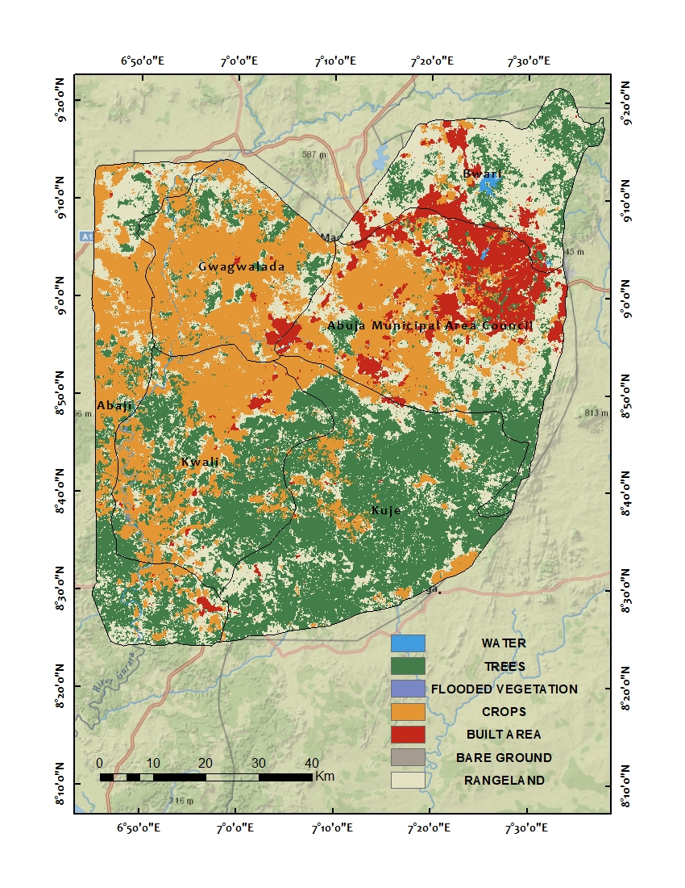
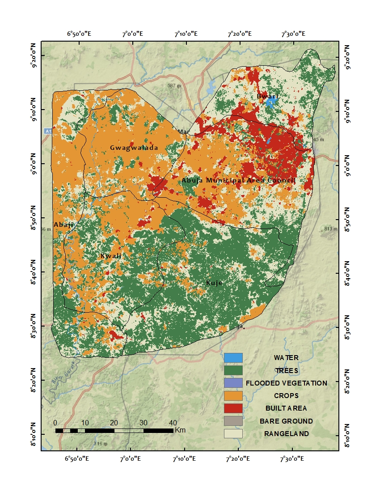
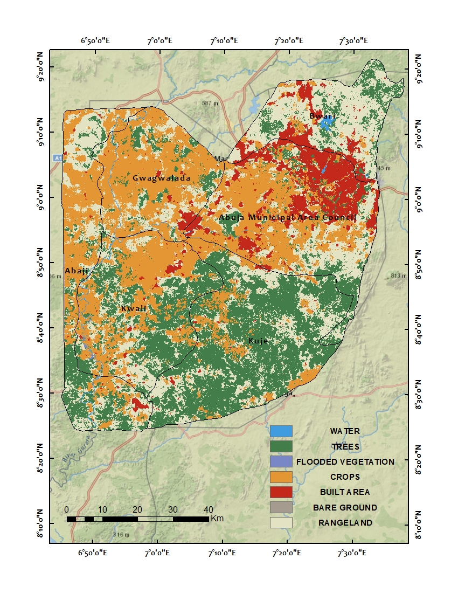
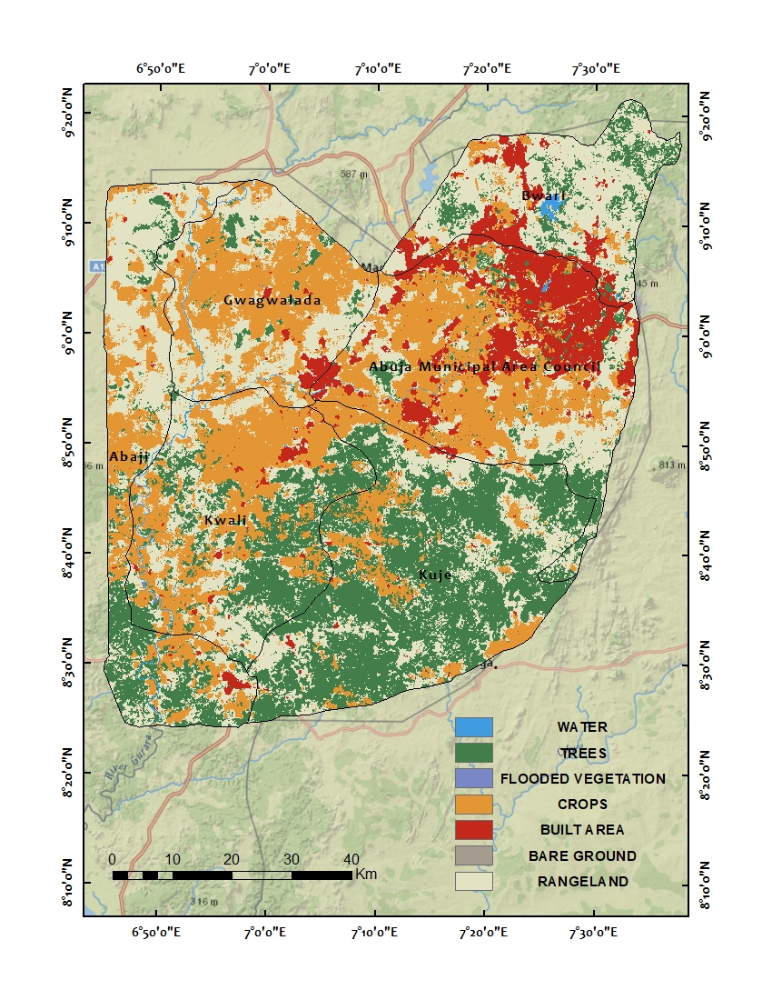
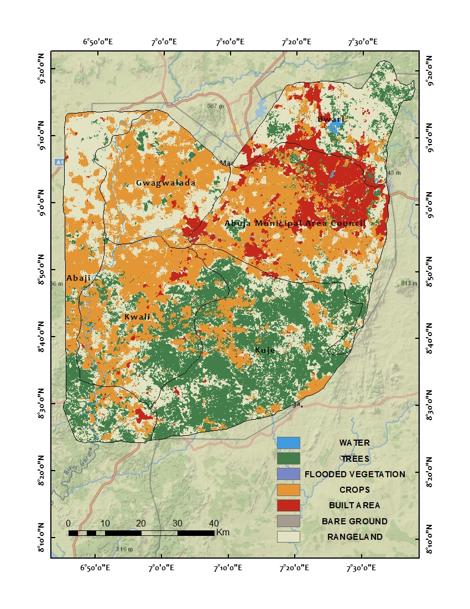
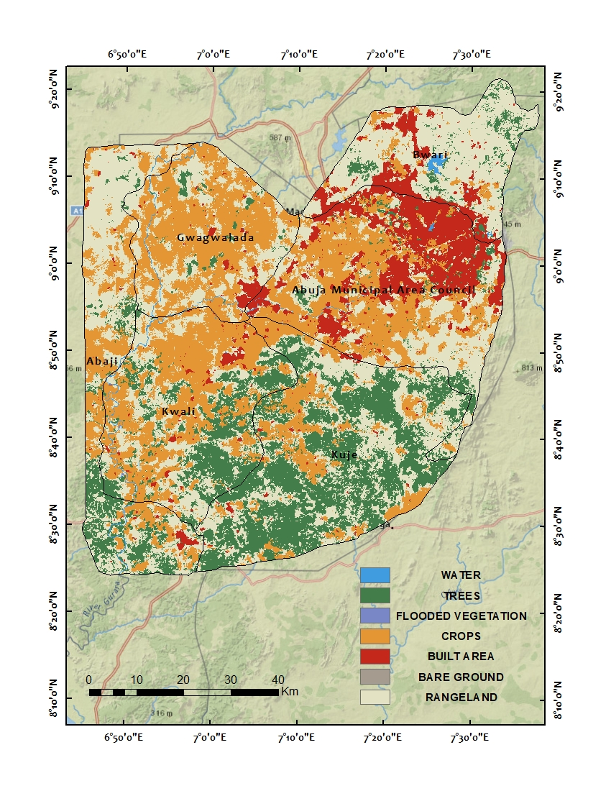

# Land-Use-Analysis_Abuja
GIS analysis of 2017 to 2022 Sentinel-2 Land use map for Abuja, Nigeria 

# Table of Contents
1. [Overview](#Overview)
2. [About](#About)
3. [Dataframe Structure](#Dataframe-Structure)
4. [LULC Map(2017-2022)](#LULC Map(2017-2022)
5. [Limitation](#Limitation)
6. [Credits(Attribution)](#Credits(Attribution))
7. [References](#References)

 # Overview
In this project, the data obtained displays a map of land use/land cover (LULC) derived from [ESA Sentinel-2 imagery](https://livingatlas.arcgis.com/landcoverexplorer/#mapCenter=-83.21%2C34.332%2C4&mode=step&timeExtent=2017%2C2021&year=2017&downloadMode=true) at 10m resolution. Each year is generated with Impact Observatory’s deep learning AI land classification model, trained using billions of human-labeled image pixels from the National Geographic Society. The maps are produced by applying this model to the Sentinel-2 Level-2A image collection on Microsoft’s Planetary Computer, processing over 400,000 Earth observations per year.

# About
Abuja is the capital and eighth most populous city of Nigeria.[5] Situated at the center of the country within the Federal Capital Territory (FCT), it is a planned city built mainly in the 1980s based on a master plan by International Planning Associates (IPA), a consortium of three American planning and architecture firms made up of Wallace, Roberts, McHarg & Todd (WRMT – a group of architects) as the lead, Archisystems International (a subsidiary of the Howard Hughes Corporation), and Planning Research Corporation. The Central Business District of Abuja was designed by Japanese architect Kenzo Tange. It replaced Lagos, the country's most populous city, as the capital on 12 December 1991.
Abuja's geography is defined by Aso Rock, a 400-meter (1,300 ft) monolith left by water erosion. The Presidential Complex, National Assembly, Supreme Court, and much of the city extend to the south of the rock. Zuma Rock, a 792-meter (2,598 ft) monolith, lies just north of the city on the expressway to Kaduna.

Land use and land cover analysis is a process of examining and categorizing the different types of land use and land cover within a particular area or region. It involves studying the physical and human-made features present on the Earth's surface and classifying them into various categories based on their characteristics and functions.
The analysis of land use and land cover is crucial for understanding the spatial distribution of different land uses, such as urban areas, agricultural lands, forests, water bodies, and natural landscapes. It provides valuable information about the extent, composition, and changes occurring in the land cover over time. This analysis helps in monitoring and managing land resources, assessing environmental impacts, and supporting various planning and decision-making processes.
There are several methods and tools used for land use and land cover analysis, including remote sensing, geographic information systems (GIS), aerial photography, and field surveys. Remote sensing, which involves the use of satellite or airborne sensors to capture data about the Earth's surface, is particularly useful for large-scale land cover mapping and monitoring.

## Methodology
The process of land use and land cover analysis typically involves the following steps:

1. Data acquisition: Acquiring relevant data from satellite imagery, aerial photographs, or other sources.
2. Preprocessing: Cleaning and preparing the data for analysis, including correcting geometric and radiometric distortions and removing noise or artifacts.
3. Classification: Using various algorithms or techniques to classify the land cover into different categories based on spectral, spatial, or temporal characteristics.
4. Accuracy assessment: Evaluating the accuracy of the classification results by comparing them with ground truth data or reference datasets.
5. Change detection: Analyzing temporal datasets to detect and quantify land cover changes that have occurred over time.
6. Visualization and interpretation: Presenting the results through maps, charts, or other visualizations, and interpreting the patterns and trends observed.

# LULC Map(2017-2022)
## 2017

## 2018

## 2019

## 2020

## 2021

##2022

# Limitation
Land use focus does not provide the spatial detail of a land cover map. As such, for the built area classification, yards, parks, and groves will appear as built areas rather than trees or rangeland classes.

The year 2017 has a land cover class assigned for every pixel, but its class is based upon fewer images than the other years. The years 2018-2022 are based upon a more complete set of imagery. For this reason, the year 2017 may have less accurate land cover class assignments than the years 2018-2022.

# Credit(Attribution)
Training data for this project makes use of the National Geographic Society Dynamic World training dataset, produced for the Dynamic World Project by the National Geographic Society in partnership with Google and the World Resources Institute.

Impact Observatory, Microsoft, and Esri.

(https://ic.imagery1.arcgis.com/arcgis/rest/services/Sentinel2_10m_LandCover/ImageServer)
This work is licensed under a Creative Commons by Attribution (CC BY 4.0) license.

[View License Deed](https://creativecommons.org/licenses/by/4.0/) || [View Legal Code](https://creativecommons.org/licenses/by/4.0/legalcode)

# References
Karra, Kontgis, et al. “Global land use/land cover with Sentinel-2 and deep learning.” IGARSS 2021-2021 IEEE International Geoscience and Remote Sensing Symposium. IEEE, 2021.

"Define Abuja's at Dictionary.com". dictionary.com. Random House, Inc. Retrieved 23 January 2023.

"Abuja | Geography, Development, & Population | Britannica". www.britannica.com. Retrieved 23 January 2023.

Ogbuenyi, Nosike (3 February 2022). "Abuja at 46: The Dreams, Strides, Challenges". Premium Times Nigeria. Retrieved 23 January 2023.

"The Nigeria Capital City – AMLSN National Conference". Retrieved 23 January 2023.

"Central area of New Federal Capital City of Nigeria". Tange Associates. Retrieved 19 February 2022.

"Life of poverty in Abuja's wealth". news.bbc.co.uk. BBC News, Tuesday, 13 February 2007. 13 February 2007. Retrieved 25 January 2023.

titel. "Build a house in Japan | Connect with Japanese Architects | titel". Retrieved 25 January 2023.

